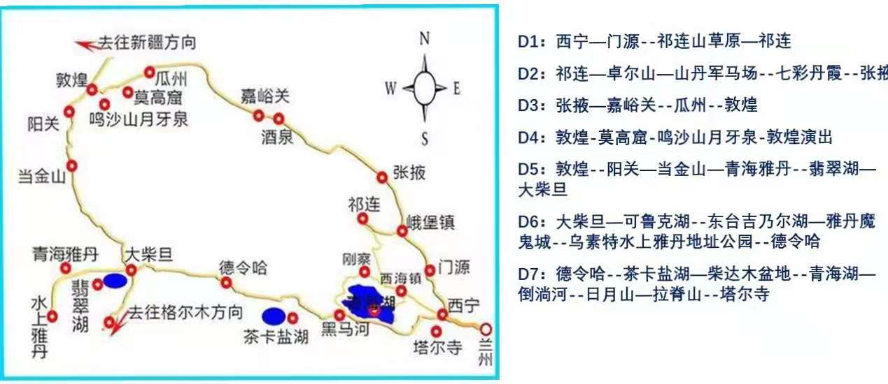
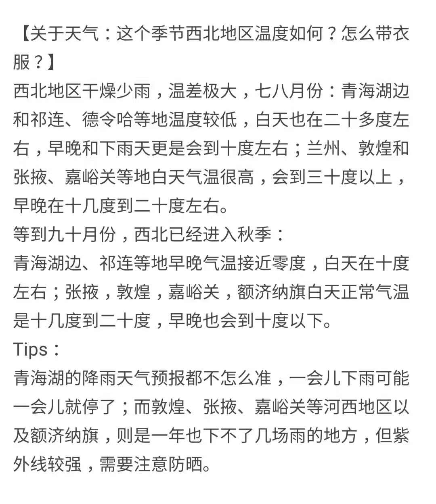
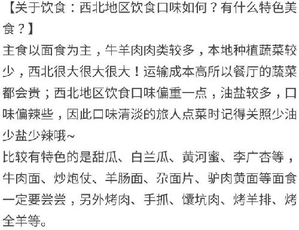
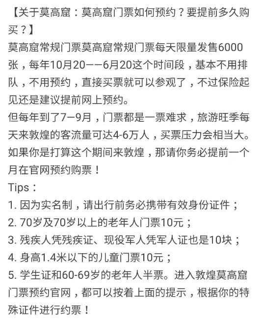

# 青甘环线 2021.7.17~25

上图仅供参考 from anna

## D0 7.17 北京/上海 ~ 西宁

酒店🏬: 如果都在机场的话, 我们就可以考虑住机场酒店, 好好休息明天开启飞行模式

## D1 7.18 西宁市区酒店8:00出发

-> 门源油菜花 136 公里 🚗2.5小时(8:00~10:30)

-> 卓尔山 150公里 🚗2小时15分 

-> 张掖市(宿🏬) 200公里 🚗3个小时 

酒店: 全季酒店张掖西站店 370

## D2 7.19 张掖酒店8:00出发

-> 七彩丹霞 35公里 🚗50分钟 

可以游玩时间长点如果计划去长城的话需要缩短游玩时间，大概中午13:00到嘉峪关

-> 嘉峪关(宿🏬) 218公里 🚗3小时 

不去长城的话，时间很充足，中途去临泽县吃中饭，晚餐在嘉峪关市里找吃的

嘉峪关土筑-酒店

水墨名关假日-酒店

(备选酒泉: 好像没有和卫星相关的景点 住宿🏬:

- 酒泉宾馆 老字号

- 酒泉航海国际 新酒店非常不错
)

## D3 7.20 嘉峪关/酒泉酒店8:00出发

-> 敦煌 377/400公里 🚗4小时15分钟/4.5(长距离开车)

大概中午12:30到敦煌

下午鸣沙山月牙泉游玩

酒店🏬:

- 敦煌华夏国际大酒店五星 450 

- 月牙湾 沙漠露营营地 双人普通帐篷 400

- 宜好精选酒店 300

## D4 7.21 敦煌 

莫高窟深度游一天

敦煌博物馆 - 讲述丝绸之路- 免费需要微信预约 

酒店🏬:华夏国际大酒店伺候着

## D5 7.22 敦煌酒店8:00出发

PLAN A:

-> 阳关景区 60公里 🚗1小时

-> 当金山 125公里 🚗2小时

-> 大柴旦翡翠湖 223公里 🚗3小时

宿:大柴旦镇

大柴旦附近有好多景点 ，好纠结

PLAN B: 开车八小时

-> 大柴旦翡翠湖 362公里 🚗5小时

大柴旦附近住宿太贵，考虑一下德令哈

-> 德令哈 219公里 🚗3小时 七天优品酒店350

## D6 7.23 大柴旦/德哈令 出发

PLAN A: 上午游玩大柴旦的其他景点

-> 翡翠湖 到 400公里 🚗5小时(直接开车到青海湖边酒店或者民宿)

PLAN B: 茶卡盐湖景点

-> 德令哈 到 茶卡盐湖 200公里 🚗2.5小时(游完后可直接去青海湖环湖的酒店)

## D7 7.24 青海湖

深度游一天

行车150公里 🚗2.5小时后入住西宁市区酒店

宿: 西宁金鼎丽呈酒店 500元

## D8 7.25 西宁市区

-> 塔尔寺 

-> 机场 中午出发去机场

注意事项:
- 天气

- 饮食

- 景色

- 消费

- 莫高窟
