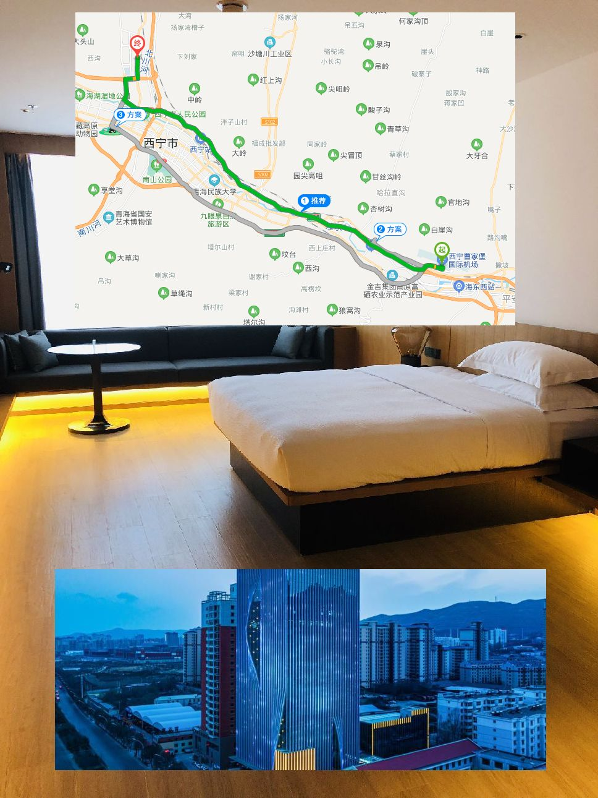
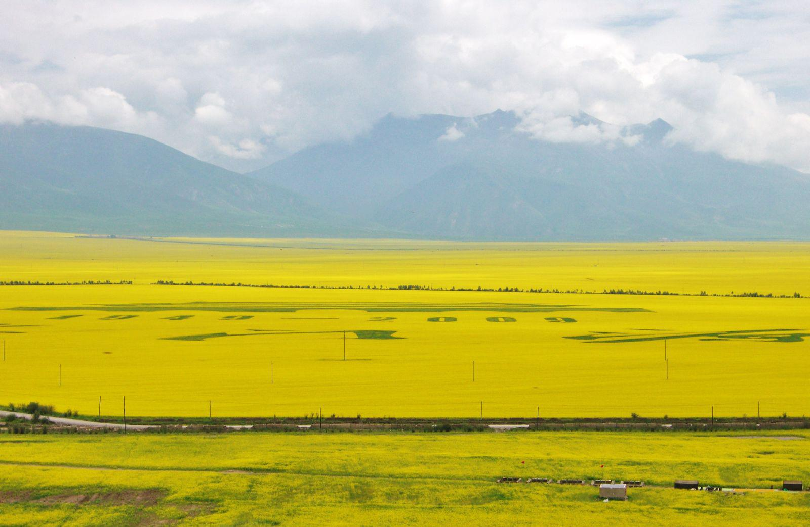
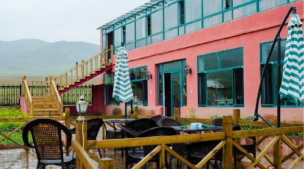
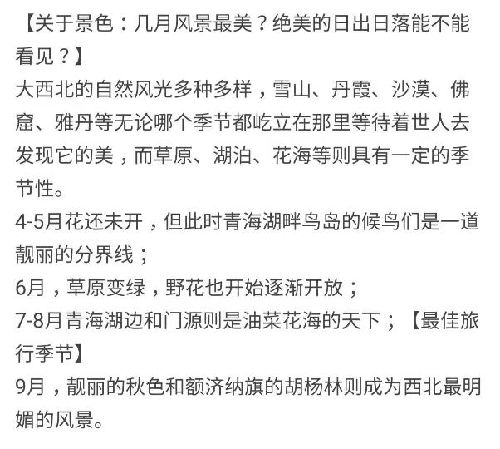
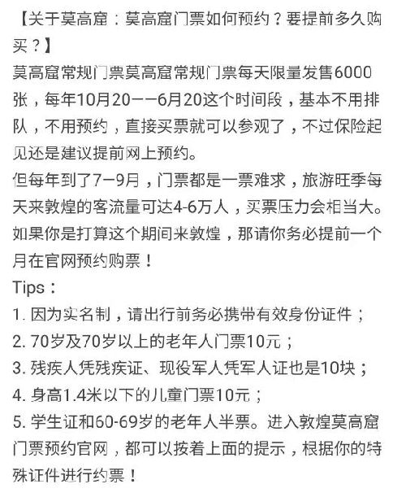

# 青甘环线 2021.7.17~25

上图仅供参考 from anna

---

| 日期 | 酒店 | 行程 |距离 |开车时长 |备注 |
| :-----| :---- | :---- |:---- |:---- |:---- |
| 7.17 | 西宁万枫酒店 | 机场->酒店 |36公里 |50分钟 | 酒店集合|
| 7.18 | 张掖全季西站店 | 酒店->张掖  |公里 |小时 |门源,卓尔山 - 控制景点游玩时间 |
| 7.19 | 酒泉航海国际 | 张掖->酒泉 |公里 |分钟 | 七彩丹霞|
| 7.20 | 敦煌博汇文华酒店 | 酒泉->敦煌 |公里 |分钟 | 鸣沙山月牙泉|
| 7.21 | 敦煌博汇文华酒店 | 敦煌市区 |公里 |分钟 | 敦煌博物馆, 莫高窟|
| 7.22 | 德令哈汉庭优佳 | 敦煌->德令哈 |公里 |分钟 | 大柴旦翡翠湖|
| 7.23 | 青海湖心灵树生活艺术家客栈 | 德令哈->青海湖客栈 |公里 |分钟 | 茶卡盐湖|
| 7.24 | 西宁万枫酒店 | 青海湖->酒店 |公里 |分钟 | 青海湖周边游, 最美公路|
| 7.25 | --- | 酒店->塔尔寺->机场 |公里 |分钟 | 塔尔寺, 还车|

---

## D0 7.17 北京/上海 ✈ 西宁

🚗 汉兰达 --- 机场取车酒店还车  
- 登记**李建慧**7月17日**19:00**取车，7月24日**20:00**点酒店还车

🚗 沃兰多 --- 机场取车机场还车 
- 登记**李哲贤**7月17日**15:30**取车，7月25日**14:00**机场还车

机场至酒店 路线: **42分钟 36.7公里** 途经：京藏高速、宁张路 收费约5元

酒店🏬: 万枫酒店 西宁市城北区宁张路111号
⬇⬇⬇

---

## D1 7.18 西宁市区酒店8:00出发

➡ 门源油菜花 136 公里 🚗2.5小时(8:00~10:30)

➡ 卓尔山 150公里 🚗2小时15分 

➡ 张掖市(宿🏬) 200公里 🚗3个小时 

酒店🏬: 全季酒店张掖西站店 四个大床房

吃饭:

油菜花⬇⬇⬇

卓尔山⬇⬇⬇

---

## D2 7.19 张掖酒店8:00出发

➡ 七彩丹霞 35公里 🚗50分钟 

可以游玩时间长点如果计划去长城的话需要缩短游玩时间，大概中午13:00到嘉峪关

➡ 酒泉(宿🏬)  218公里 🚗3小时

酒店🏬: 酒泉航海国际

不去长城的话，时间很充足，中途去临泽县吃中饭，晚餐在酒泉市里找吃的

~~➡ 嘉峪关(宿🏬) 218公里 🚗3小时~~ 

~~嘉峪关土筑-酒店~~ 

~~水墨名关假日-酒店~~ 

---

## D3 7.20 嘉峪关/酒泉酒店8:00出发

➡ 敦煌 377/400公里 🚗4小时15分钟/4.5(长距离开车)

计划: 
- 中途可以考虑在**嘉峪关**拍个集体照片
- 大概中午12:30到敦煌, 下午**鸣沙山月牙泉**游玩

酒店🏬:敦煌博汇文华酒店

---

## D4 7.21 敦煌 

莫高窟深度游一天

敦煌博物馆(免费) - 讲述丝绸之路- 需要微信预约 

酒店🏬:敦煌博汇文华酒店

---

## D5 7.22 敦煌酒店8:00出发

~~PLAN A:~~  
~~➡ 阳关景区 60公里 🚗1小时~~  
~~➡ 当金山 125公里 🚗2小时~~  
~~➡ 大柴旦翡翠湖 223公里 🚗3小时~~  
~~宿🏬:大柴旦镇 - 大柴旦附近有好多景点 ，好纠结~~

**PLAN B: 开车八小时**

➡ 大柴旦翡翠湖 362公里 🚗5小时

➡ 德令哈 219公里 🚗3小时  需要考虑晚上开车

宿🏬: 汉庭优佳

东台吉乃尔湖⬇⬇⬇

水上雅丹⬇⬇⬇

---

## D6 7.23 德哈令 出发

~~PLAN A: 上午游玩大柴旦的其他景点~~  
~~➡ 翡翠湖 到 400公里 🚗5小时(直接开车到🏬青海湖边酒店或者民宿)~~

PLAN B: 茶卡盐湖景点  
➡ 德令哈 到 茶卡盐湖 200公里 🚗2.5小时(游完后可直接去青海湖环湖的酒店

酒店: 青海湖心灵树生活艺术家客栈

---

## D7 7.24 青海湖 深度游一天

➡ 西宁市区 行车150公里 🚗2.5小时后入住西宁市区酒店

宿🏬: 万枫酒店 西宁市城北区宁张路111号

---

## D8 7.25 西宁 ✈ 北京/上海

➡ 塔尔寺 

➡ 机场 中午出发去机场 还车🚗

---

注意事项:
- 天气  

- 饮食  

- 景色  

- 消费  

- 莫高窟  
